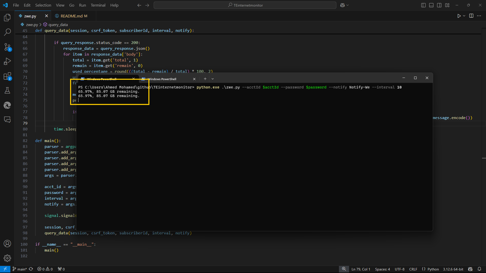

# TE Internet Usage Monitor

This script monitors internet usage for TE (Telecom Egypt) ISP users, providing updates on usage percentage and remaining data allowance.

## Quick Start
### bash script zwe.py is old version use the py version
```bash
git clone https://github.com/yourusername/TEinternetmonitor.git
cd TEinternetmonitor
python3 --acctId <username> --password <password> [--sleep <interval>] [--n <notify_id>]
```

## Requirements

- `Bash` Or `Py3`
- `notify`

## Options

- `--acctId`: TE ISP username.
- `--password`: TE ISP password.
- `--sleep`: Interval in seconds between checks (default 60).
- `--notify`: Notification ID for custom notifications (optional).

## Usage

Run the script with necessary options:

```bash
python3 --acctId <username> --password <password> [--sleep <interval>] [--n <notify_id>]
python3 ./zwe.py --acctId <username> --password <password>
```
